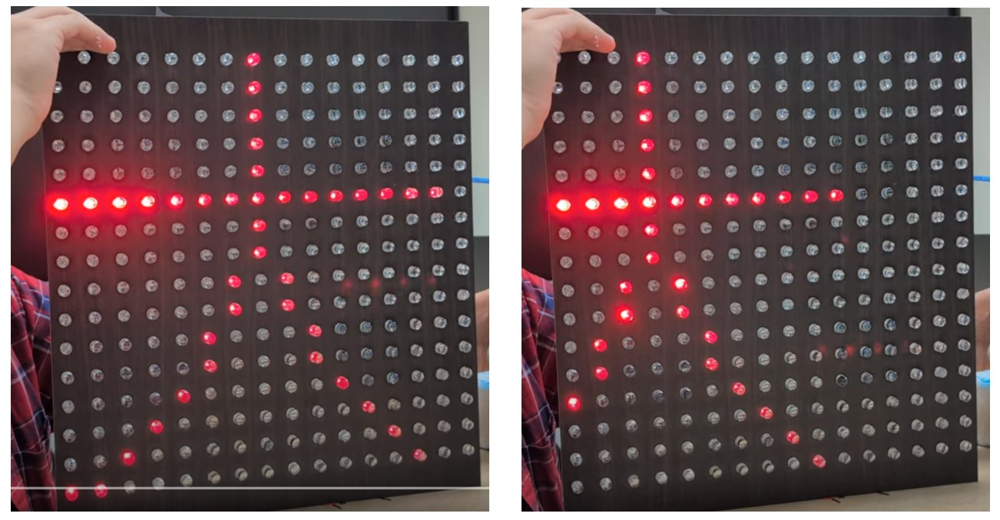
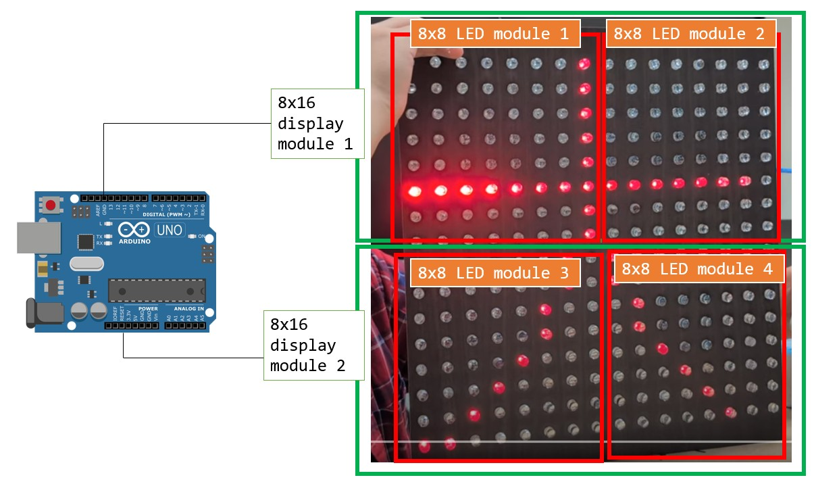

# Arduino-based 16×16 LED Matrix System for Large Character Display with Scrolling Effects
## 自製 16×16 大型 LED 矩陣 與中文跑馬燈效果

## 介紹 Introduction

這個專案目的是從零開始自製大型 LED 矩陣，包含了將 LED 燈泡串接為 LED 矩陣、使用 MAX7219 驅動晶片並自製擴展板連接至 LED 矩陣，以及將多個 MAX7219 模組串接至一個 Arduino Uno 板，並且透過程式驅動，顯示出跑馬燈的效果。

這個 repository 的內容包含了精簡版和完整版；
在 readme 中呈現的是精簡版，適合看到電路就能在萬能板上重製的朋友，直接下載電路圖及 Arduino 程式就可使用。  
完整版包含了四份分開的教材 pdf，適合完全沒有程式語言或電路學基礎的朋友，從零開始手把手帶你製作出成果；

This project aims to build a large LED matrix from scratch, including connecting LED bulbs into a matrix, using the MAX7219 driver chip, creating an expansion board, and connecting multiple MAX7219 modules to an Arduino Uno board to display scrolling effects through programming. 

This GitHub repository offers both a simplified version and a full version: the full version is for beginners with no prior programming or circuit knowledge, providing a step-by-step guide to achieve the results, while the quick version is for those familiar with circuits and Arduino, offering the circuit diagram and code for immediate use.

This is the final effect. The character scrolls from right to left.

## 系統概述 System Overview

這個 16x16 LED 矩陣系統由 4 個 8x8 LED 模組組成，
每個 LED 模組由 1 個 MAX7219 驅動晶片控制，
再將每 2 個 LED 模組串接為一個 8x16 的顯示模組，(共 2 個 8x16 的顯示模組)，作為跑馬燈顯示的基本單位。
透過 Arduino Uno 控制器來控制 2 個顯示模組，顯示出中文跑馬燈效果。

This 16x16 LED matrix system consists of four 8x8 LED modules, with each module controlled by a MAX7219 driver chip. 
Two LED modules are connected to form an 8x16 display module, and two 8x16 display modules are used as the basic unit for the scrolling display. 
The Arduino Uno controller is used to control two display modules to display Chinese scrolling effects.

## 材料 Materials

|     | 項目                   | 數量                |
| --- | ---------------------- | ------------------- |
| 1.  | 白膠、熱熔膠           |                     |
| 2.  | 烙鐵                   |                     |
| 3.  | 焊錫                   |                     |
| 4.  | 斜口鉗、剝線鉗、尖嘴鉗 |                     |
| 5.  | 木板                   | 1 片  (?? 大小?)              |
| 6.  | 單芯線                 | (建議至少 2 種顏色) |
| 7.  | LED燈泡 (我們用的是 10mm)         | 256個               |
| 8.  | 杜邦線                 |                     |
| 9.  | 三用電表               | 1                   |
| 10. | 萬用板                 | 4                   |
| 11. | MAX7219 驅動晶片       | 4                   |

## 製作流程 
### 1. LED 矩陣製作 LED Matrix Production
詳細的製作過程，可以看: [用 LED 燈泡自製 LED 顯示矩陣的手把手教學by楊禮安 Li-An Yang_Craft your 16x16 LED with MAX7219 driver](Li-An%20Yang_Craft%20your%2016x16%20LED%20with%20MAX7219%20driver.pdf)

(這裡要請禮安幫忙, 用一個螢幕的篇輻，講解 16x16 的 LED 矩陣如何製作, 並且附上 8x8 LED電路圖)

### 2. MAX7219 擴展板製作 MAX7219 Breakout Board Production
詳細的製作過程，可以看: [MAX7219
晶片與 LED 矩陣分線板電路實現by陳冠羽 Guan-Yu Chen_MAX7219_breakout_board](Guan-Yu%20Chen_MAX7219_breakout_board.pdf)

(這裡要請冠羽幫忙, 用一個螢幕的篇輻，講解 MAX7219 擴展板如何製作, 並且附上 MAX7219 PIN 腳圖)

### 3. LED 模組串接 LED Module Connection
詳細的製作過程，可以看: [用 LED 燈泡自製 LED 顯示矩陣的手把手教學by楊禮安 Li-An Yang_Craft your 16x16 LED with MAX7219 driver.pdf](Li-An%20Yang_Craft%20your%2016x16%20LED%20with%20MAX7219%20driver.pdf)
(這裡要請禮安幫忙, 用一個螢幕的篇輻，講解如何組裝 LED 矩陣)

### 4. 跑馬燈程式碼 Code
請在 Arduino IDE 中安裝程式庫 LedControl

詳細流程可參考：[米羅科技有限公司提供的教材](https://shop.mirotek.com.tw/tutorial/arduino-max7219)

針對 MAX7219 串連成的顯示模組如何用，可看: [使用MAX7219控制模組進行程式開發 by 王儷蓁 Li-Jen Wang_LED control by MAX7219](Li-Jen%20Wang_LED%20control%20by%20MAX7219.pdf)

詳細的 LED 跑馬燈原理，可以看: [從認識Arduino板基礎到用Max7219做出16＊16跑馬燈程式碼 by 彭歆惠 (Peng_Shin Huei 16x16 LED scrolling effect from scratch.pdf)](Peng_Shin%20Huei%2016x16%20LED%20scrolling%20effect%20from%20scratch.pdf)

首先設定好 LED 顯示器的控制方式，這裡有兩組 LED 控制器 (lc 和 lc2)，各自控制 2 個 8x8 的 LED 點陣。可以藉由修改 LedControl 來支援更多 MAX7219 控制器。這些控制器透過 DIN (資料)、CS (片選)、CLK (時鐘) 來跟 MAX7219 溝通，讓 LED 亮起來。
接著準備要顯示的圖案，這裡定義了 兩組圖案 (daCharacter1, daCharacter2 和 newCharacter1, newCharacter2)，每個圖案是 16 列，每列 8 個點。可以修改 daCharacter1 等陣列來顯示不同的內容，圖案的格式是 二進制數 (B00000110 這種)，表示哪些 LED 要亮。
開始顯示後的滾動效果以scrollMessage() 這個函數，外層 for 迴圈（offset = 15 表示字形剛開始顯示在最右邊，offset = -15 則表示字形完全離開左側）讓圖案從最右邊出現，慢慢往左邊滑動消失。讓第一組圖案滾動，然後再讓第二組圖案滾動。

First of all, set the control mode of the LED display, there are two sets of LED controllers (lc and lc2), each of which controls two 8x8 LED dot matrix. LedControl can be modified to support more MAX7219 controllers. These controllers communicate with the MAX7219 via DIN (data), CS (chip select), and CLK (clock) to make the LEDs light up.Then prepare the pattern to be displayed, here we define two sets of patterns (daCharacter1, daCharacter2 and newCharacter1, newCharacter2), each pattern is 16 columns, each column has 8 points. Arrays such as daCharacter1 can be modified to display different content, and the pattern is formatted as binary numbers (B00000110 this one) to indicate which LEDs are to be lit.The scrolling effect after the start of the display is the scrollMessage() function, and the outer for loop (offset = 15 means that the glyph is displayed at the far right at first, offset = -15 means that the glyph is completely away from the left) makes the pattern appear from the far right, and slowly slides to the left to disappear. Let the first set of patterns roll, and then let the second set of patterns roll.

每次滾動時，程式會一列一列地往左移動，讓圖案產生流動感。而內層 for 迴圈 (row < 8)。每次移動後，程式會更新 LED 的顯示內容，並延遲 200 毫秒 來控制滾動速度。完成滾動後會停頓 1 秒，然後換下一組圖案，讓它們輪流播放。

Each time you scroll, the program moves to the left, column by column, giving the pattern a sense of fluidity. And the inner layer for loop (row < 8). After each movement, the program updates the display of the LEDs with a 200 millisecond delay to control the scrolling speed. There is a 1-second pause when you finish scrolling, then you swap out a set of patterns and let them take turns.

最後的程式碼，請見  [code/final_scrolling_Da.ino]
(這裡要請儷蓁幫忙把最後一版跑馬燈的大字程式碼 .ino 檔上傳)

## 作者 Credits
楊禮安 慈濟大學醫學工程系

陳冠羽 慈濟大學醫學工程系

彭歆惠 慈濟大學醫學工程系

王儷蓁 慈濟大學醫學工程系

楊惠雯 慈濟大學醫學工程系

## 相關參考連結

## 版權聲明 Copyright

本專案的程式碼與文件皆以 [MIT License](https://opensource.org/licenses/MIT) 授權發布，您可以自由使用、修改與分享，但請保留原始授權聲明。  

專案中的圖片、電路設計及其他非程式碼內容，除非另有標示，均屬作者所有，未經許可不得用於商業用途。  

若您使用本專案的內容，請適當標註來源，並歡迎提供改進意見或回饋！

This project’s code and documentation are released under the [MIT License](https://opensource.org/licenses/MIT), allowing free use, modification, and distribution, provided that the original license notice is retained.  

Unless otherwise stated, images, circuit designs, and other non-code content in this project are the property of the author and may not be used for commercial purposes without permission.  

If you use any part of this project, please give proper attribution. Feedback and contributions are always welcome!

